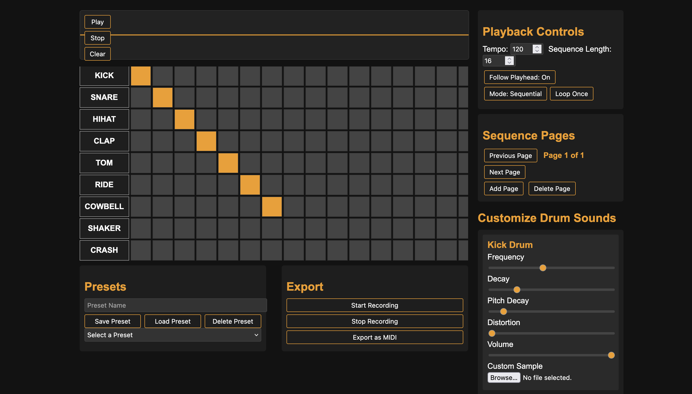
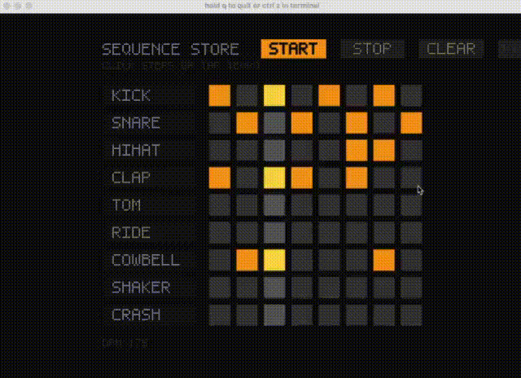

# Overview
This project explores the Week 3 theme of sequencing. I decided to build a drum pad sequencing machine. It functions both as: an implementation of symbolic data, iterative structures, time-based execution, and as a response to the reading by **Elizabeth Hellmuth Margulis and Rhimmon Simchy-Gross (2016)** and their claim that “repetition becomes music.” Through code, the project demonstrates how rhythmic structure emerges automatically when discrete symbolic instructions are looped over time, and how obvious and reductive the authors’ experimental design seemed to me as a practitioner working directly with algorithmic sequencing.  

Margulis and Simchy-Gross argue that looping even random tone sequences increases their perceived musicality. This project explores that premise in a more explicit, technical way: by exposing every element of the timing, data structure, and symbolic repetition. Whereas their experiment operates at a perceptual and psychological level, my system builds musicality through transparent mechanisms—grid structure, temporal quantisation, symbolic scheduling—showing how musical impressions emerge from design rather than cognitive mystery.

I had already built a bigger drum machine in JS that allowed for saving of patterns, changing of page time signatures, multiple pages, and other fun features like uploading custom sounds. So I already had a plan: build the grid, add the sounds, connect triggered buttons to sound playback, and add user labels. The first issue was that I knew Dorothy wasn’t the best for handling mouse clicks, so I asked Louis and he said it was best to do coordinate capturing.


Image of my JS version im basing this off. 


# Mouse capturing
Dorothy does not implement an event-driven input model. Instead, it exposes mouse state via a set of global attributes that reflect the current frame’s input status; such as:  
Mouse position through `dot.mouse_x`, `dot.mouseX`, `dot.mouse_y`, or `dot.mouseY`,  
Mouse button state through flags like `dot.mouse_down`, `dot.mousePressed`.

These attributes are not part of an events such as, onClick or mousePressed, but instead expose instantaneous state. This means the application must continuously sample these values each frame to determine whether a click is happening, and where.

I use `read_mouse()` function that normalises access across all possible naming variations. This seemed like something I didn’t need to write out my self so I asked chatGPT to:

```python
def read_mouse() -> Tuple[bool, float, float]:
    down = any(bool(getattr(dot, attr, 0)) for attr in MOUSE_DOWN_ATTRS)
    for nx, ny in (("mouse_x", "mouse_y"), ("mouseX", "mouseY")):
        if hasattr(dot, nx) and hasattr(dot, ny):
            return down, float(getattr(dot, nx)), float(getattr(dot, ny))
    return down, 0.0, 0.0
```

This function reads the current state of the mouse and returns a `(down, x, y)`. It reports that the mouse is currently held down. As a result, all interaction logic must:  
• Check whether the mouse is currently pressed.  
• Determine whether the cursor lies within a specific UI region, button or grid cell.  
• Use additional frame-based state to detect transitions, down → up.

Interaction is handled procedurally, not reactively. For example, to detect a pad click:

```python
if mouse_down and point_in_rect(mx, my, cell_bounds):
    grid[r][c] = not grid[r][c]
```

# Audio System
In my earlier JavaScript version of this project, I generated the sounds myself using the Web Audio API, so when recreating the drum machine in Python, that choice was already half made. First, I wanted the project to stand alone, with no reliance on sound file downloads. Second, synthesising the samples gives the program total control over the sound design, and avoids any potential copyright issues.

Instead of loading or triggering pre-recorded sound files, all samples are generated from scratch in memory as NumPy arrays. These waveforms are shaped using combinations of sine wave oscillation, exponential decay, filtered noise, and other fun. With this understanding of synths from my JS project I asked chatGPT to make me 9 different drum sounds, with the logic from my JS app copy and pasted in as a basses of the sounds I wanted. This seemed like a smart use of Ai as it would be a lot of coding I didn't need to copy and convert from my prevues app just to get this python version up and running. 

For example, one of the kick drum sounds is synthesised like this:

```python
env = _exp_env(0.45, sr, 6.2)
t = np.arange(env.size) / sr
sweep = 90.0 * np.exp(-6.0 * t) + 42.0
tone = np.sin(2 * np.pi * np.cumsum(sweep) / sr)
click = np.exp(-220 * t) * (rng.random(env.size) * 0.2)
kit.append(_normalize(tone * env + click, 0.86))
```

This creates a deep synthetic thump by combining a downward frequency sweep with a noisy click, shaped by an envelope. Similar methods were used to construct the other percussive voices in the kit.

Playback is handled using a custom `get_frame(size)` function, which Dorothy calls repeatedly to fill the output audio buffer. This function mixes together any samples that are currently active:

```python
def get_frame(size: int) -> np.ndarray:
    audio = np.zeros(size, dtype=np.float32)
    for idx, pos in enumerate(self.positions):
        if pos < 0:
            continue
        sample = self.samples[idx]
        end = min(pos + size, len(sample))
        chunk = sample[pos:end] * self.gains[idx]
        audio[:len(chunk)] += chunk
        self.positions[idx] = -1 if end >= len(sample) else end
        if self.positions[idx] == -1:
            self.gains[idx] = 0.0
    return np.clip(audio, -1.0, 1.0)
```

The sampler supports polyphonic playback, overlapping hits, and velocity-sensitive gain control. Sounds are triggered using `.trigger()`, which resets the playback position and applies a gain multiplier based on velocity, which is fixed at 0.85 in python as standard, but this allows for more user control inputs if I was to continue with this app.

```python
def trigger(self, index: int, velocity: float = 0.85) -> None:
    if 0 <= index < len(self.samples):
        self.positions[index] = 0
        self.gains[index] = max(0.0, min(1.0, float(velocity)))
```

# Controlling Time and Sequence
The musical structure of the app is stored symbolically, as a 2D grid of booleans. Each row represents an instrument or sound, and each column represents a step in time. A True value means that step is active and should trigger a sound when the playhead passes over it.

```python
grid = [[False] * STEP_COUNT for _ in GRID_ROWS]
```

Timing is handled manually using real elapsed time in milliseconds. The current time is compared against the last step time, and when enough time has passed, the sequencer advances by one step.

```python
while now - last_step_time >= step_millis:
    last_step_time += step_millis
    current_step = (current_step + 1) % STEP_COUNT
```

This creates a consistent looping timeline, where `current_step` tracks the horizontal playhead position moving across the grid. Each tick of the sequencer checks the grid at that step, and if a cell is True, the corresponding sound is triggered using:

```python
if grid[row_index][current_step]:
    sampler.trigger(row_index)
```

The playhead moves by comparing system time (`dot.millis()`), not by relying on Dorothy’s `draw()` loop, giving tighter and more consistent control over timing.

# Rendering
The visual interface is minimal but functional. It consists of a grid of square buttons representing each step in the sequence, updated in real time to show the current state of the sequencer.

Each frame, the app calls a `draw_grid(current_step)` function, which loops through the 2D grid and draws each step as a rectangle. The grid reflects the musical data directly: if a cell is True, it’s drawn as an “on” square; otherwise, it’s “off.” If the column matches the current step (from the sequencer), that column is visually highlighted to indicate the playhead’s position.

```python
def draw_grid(current_step: int) -> None:
    for row_index, row in enumerate(grid):
        row_y = GRID_TOP + row_index * (CELL_SIZE + CELL_GAP)
        for col_index, is_on in enumerate(row):
            cell_x = GRID_LEFT + col_index * (CELL_SIZE + CELL_GAP)
            colour = STEP_ON if is_on else STEP_OFF
            if col_index == current_step:
                colour = highlight(colour, 54 if is_on else 36)
            dot.fill(colour)
            dot.rectangle((cell_x, row_y), (cell_x + CELL_SIZE, row_y + CELL_SIZE))
```

This function is called inside the main `draw()` loop, displaying updates every frame based on the latest state of the grid and sequencer. The result is a live visual representation of what the user hears. Each step is highlighted as the playhead moves across them. The grid and the sound logic are always in sync: the visual playhead highlights the same step that the audio engine is checking in the background. This keeps the timing easy to understand for the user while also providing a good vies test of a working system.


# More UI… Text, and tap to tempo  

# Text Rendering
For this project, I built a custom dot-matrix text renderer instead of using a standard text library like OpenCV. At the time, I wasn’t aware that Dorothy worked with OpenCV, and I wanted to avoid adding extra dependencies that people would need to install. My goal was to make the code run on its own without needing any external files or packages beyond Dorothy and NumPy.

The pixel-style lettering not only fit well with the overall visual aesthetic of the sequencer, but also reflected the symbolic, data-driven approach we were exploring in class — especially in relation to sequencing and encoding information. Once I had it working, I showed it to Louis, who mentioned that OpenCV would have made text rendering easier. That’s something I’d definitely consider for future projects, but since I already had a complete and working system in place, I was happy to stick with it here.

The code defines a pixel font using a dictionary called `FONT_5X7`. Each character is represented as a list of strings, where 1 marks a filled pixel and 0 as blank:

```python
FONT_5X7: Dict[str, Tuple[str, ...]] = {
    " ": ("00000",) * 7,
    "0": ("01110", "10001", "10011", "10101", "11001", "10001", "01110"),
}
```

The `draw_text()` function takes the 1s and 0s for each character, loops through them, and draws a small rectangle wherever there’s a "1". You can control the scale to make the letters bigger or smaller on screen.

```python
def draw_text(message: str, pos: Tuple[int, int], colour: Tuple[int, int, int] = (220, 220, 220), scale: int = 4) -> None:
    ...
    for row, row_data in enumerate(glyph):
        for col, bit in enumerate(row_data):
            if bit != "1":
                continue
            x0 = x_cursor + col * scale
            y0 = y_cursor + row * scale
            dot.rectangle((x0, y0), (x0 + scale, y0 + scale))
```

All interface text — such as “SEQUENCE STORE”, “CLICK STEPS OR TAP TEMPO”, and button labels like “START” or “TAP TEMPO” — is rendered using this method. There’s also a `measure_text()` function that calculates width and height in pixels, used for layout and centring.

As you can see in the code this is a lot of repetitive but slightly difrent code to write, so it seemed like the perfect use for the AI intern, so I asked chatGPT to give me the full text handling code block for all letters.

# Tap-to-Tempo button
The app uses a tap-to-tempo feature; this choice came from both practical and conceptual considerations.

From a technical perspective, the app was already built around mouse interaction, clicking steps, triggering buttons, and controlling playback with a simple, visual layout. Adding tempo control through a “TAP TEMPO” button allowed for the reuse of the same mouse input system already handling grid clicks and button presses.

From a design perspective, tap tempo feel more like a physical drum machine, and it invites users to play the tempo in a tactile, rhythmic way.

The `tap_tempo()` function keeps a list of recent tap times, filters out old taps (more than 4 seconds ago), and calculates the average interval between them:

```python
def tap_tempo() -> None:
    now = read_millis()
    tap_times.append(now)
    while tap_times and now - tap_times[0] > TAP_WINDOW:
        tap_times.pop(0)
    if len(tap_times) < 2:
        return
    intervals = [t2 - t1 for t1, t2 in zip(tap_times, tap_times[1:])]
    avg = sum(intervals) / len(intervals)
    if avg <= 0:
        return
    set_bpm(60000.0 / avg)
```

The BPM is updated by converting the average milliseconds per tap into beats per minute. The `set_bpm()` function then recalculates `step_millis`, which directly controls the timing of the sequencer:

```python
def set_bpm(value: float) -> None:
    global bpm, step_millis, last_step_time
    bpm = max(40, min(240, int(round(value / 5.0) * 5)))
    step_millis = 60000.0 / bpm
    last_step_time = read_millis()
```

The current BPM is displayed on screen, just under the sequencer grid:

```python
bpm_y = GRID_TOP + GRID_HEIGHT + 24
draw_text(f"BPM {bpm}", (GRID_LEFT, bpm_y), colour=(180, 180, 180), scale=2)
```

This integration ensures that the timing display, audio logic, and user control are linked and update in real time.




# Reflection on Sequencing
The sequencer shows how symbolic repetition becomes musical meaning. This both supports and critiques the reading’s thesis simultaneously: yes, repetition creates musicality—but not through magic or perceptual illusion. It emerges because structured repetition is designed to be interpreted that way.

Margulis and Simchy-Gross (2016) argue that looping random tones increases perceived musicality. My system demonstrates the same mechanism, but in a computationally transparent way. Rather than relying on participant perception alone, this project reveals the scaffolding: timing, structure, symbolic states, and metric alignment. Musicality is not merely discovered; it is constructed.

Their work hinges on perceptual psychology; mine shows that these perceptual effects can be reenacted through explicit symbolic systems.


# References

Margulis, E.H. & Simchy-Gross, R. (2016). *Repetition enhances the musicality of randomly generated tone sequences.* Music Perception: An Interdisciplinary Journal, 33(4), pp.509–514. doi:10.1525/mp.2016.33.4.509.
